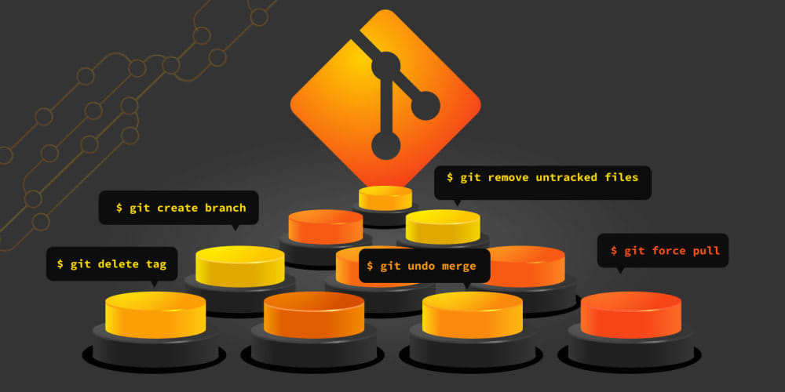

# Learn Git

Git ကို သေချာလေ့လာပါ။ အထူးသဖြင့် Git branch တွေကို အသုံးချပြီး အများနဲ့ အလုပ်လုပ်နိုင်အောင် လေ့လာထားဖို့လိုတယ်။ Project တခုရေးတဲ့အခါ VCS က မပါမဖြစ်မို့ SE တယောက်အတွက် Git ကိုသိထားရမယ်။

branch တွေအကြောင်း မပြောခင် Git ရဲ့ primer ကိုပြောကြမယ်။ နံပါတ်တစ် ဘာလို့ Git သုံးရမှာလဲ။ codebase တခုမှာ version က အရေးကြီးလို့ပါ။ error ပါတဲ့ code တွေမှားရေးမိလို့ဖြစ်ဖြစ်၊ file တွေ မှားဖျက်လိုက်မိရင်ပဲဖြစ်ဖြစ် restore လုပ်နိုင်အောင် ပြင်ဆင်ထားဖို့ လိုအပ်ပါတယ်။

အဲဒီအတွက် Operating System ကိုအားကိုးလို့မရဘူးလားဆိုရင် မရဘူးမဟုတ် ရတယ်။ ဒါပေမယ့် File storage တွေဖြစ်တဲ့အတွက် Object storage လို versioning feature ကို အရံသင့် အဆင်ပြေပြေ သုံးလို့ရမှာ မဟုတ်ပါဘူး။ ဒါကြောင့် version control အတွက် သီးသန့်တည်ဆောက်ထားတဲ့ software တွေကို သုံးကြပါတယ်။ Git က အဲဒီထဲက တခုပါ။

တိတိကျကျဆိုရင် Git က Distributed VCS (DVCS) အမျိုးအစားဖြစ်တယ်။ non-distributed VCS တွေနဲ့ ဘာကွာသွားလဲဆိုတော့ Git ကိုသုံးဖို့ သီးသန့် central server မလိုအပ်ပါဘူး။ (GitHub မရှိလည်း Git သုံးလို့ရပါတယ်)

အဲဒီလို central server မလိုတဲ့အတွက် Git repository တွေက codebase ရဲ့ commit tree တခုလုံးကို သိမ်းထားတယ်။ ဆိုလိုတာက နှစ်ယောက် အတူတူရေးရင် နှစ်ယောက်လုံးမှာ commit history အစအဆုံး ရှိလိမ့်မယ်။ commit ဆိုတာက codebase ရဲ့ version တခုလို့ မှတ်နိုင်တယ်။

Git မှာ အခြေခံအနေနဲ့ working directory, staging area, commit နဲ့ branch ဆိုပြီး 4 ခုရှိတယ်။ working directory ဆိုတာ Git repository အခြေစိုက်တဲ့ folder ကိုခေါ်တယ်။ folder ထဲက အပြောင်းအလဲတွေကို Git က track လုပ်နေမယ်။

ဒါပေမယ့် ရှိရှိသမျှ file တိုင်းကို track လုပ်နေမှာ မဟုတ်ပါဘူး။ Git track လုပ်စေချင်တဲ့ file ကိုတကြိမ်တော့ staging area ဆီထည့်ပေးရလိမ့်မယ်။ staging area ဆိုတာ နောက် commit ဆောက်ဖို့ပြင်တဲ့နေရာပါ။ နောက် commit မှာ ပါစေချင်တဲ့ file တွေကို staging area မှာစုပြီးမှ commit ကို ဆောက်ပါတယ်။

commit တွေက branch ရဲ့ အသက်ဖြစ်လို့ commit တွေကို နားမလည်ရင် branch တွေနဲ့ အလုပ်လုပ်ရ ခက်ပါလိမ့်မယ်။

commit တခုက immutable history တခုဖြစ်ပြီး ပြန်ညွှန်းလို့ရပါတယ်။ ကြိုက်တဲ့ commit ဆီပြန်သွားပြီး အဲတုန်းက ရှိခဲ့တဲ့အတိုင်း file တွေကို ပြန်ကြည့်လို့ရတဲ့အတွက် time travel လုပ်တာနဲ့ဆင်ပါတယ်။

Branch ဆိုတာ တကယ်တော့ commit history တွေကို ချိတ်ထားတာပါပဲ။ commit တိုင်းမှာ သူ့ parent commit ဆိုတာ ရှိတယ်။ အဲဒီ parent commit တွေကို ချိတ်ဆက်ထားရင်းနဲ့ branch တခုဖြစ်လာတာပါ။ ဆိုပါတော့။ တောက်လျှောက် main branch ပေါ် အလုပ်လုပ်လာတာဆိုရင် main branch ကို ရှိရှိသမျှ commit တွေနဲ့ ဖွဲ့စည်းထားတယ်လို့ ပြောလို့ရတယ်။

branch တခုကို အခြေခံပြီး နောက်ထပ် branch အသစ်တခု ဆောက်တယ်ဆိုတာက source branch ရဲ့ commit history ကိုယူပြီး နောက်ထပ် commit chain တခုထပ်ဆောက်လိုက်တာပါ။ အဲဒီ branch စဆောက်တဲ့အချိန်ထိ commit history တူပြီး အသစ်ဖြစ်လာတဲ့ commit တွေက ရှေ့ branch မှာမပါတော့ပါဘူး။

လက်တွေ့မှာ feature branch တွေကို development လုပ်ဖို့ သုံးကြပြီး main ကိုတော့ အခါခါ test ပြီးသား stable ဖြစ်တယ်ဆိုတဲ့ codebase ကို သိမ်းကြတယ်။ Git က အပေါ်မှာ ပြောခဲ့တဲ့အတိုင်း distributed ဖြစ်တဲ့အတွက် local မှာတင် commit history အပြည့်အစုံရှိပါတယ်။ အဲဒါကြောင့် ရေးလို့ စိတ်တိုင်းကျသွားပြီဆိုရင် branch နှစ်ခုကို local မှာပဲ merge လိုက်လို့ရပါတယ်။

merge တဲ့အခါ ၃ ခုဖြစ်နိုင်တယ်။

fast forward merge ကတော့ ၃ ခုထဲမှာ အရိုးရှင်းဆုံးပါပဲ။ branch တွေတိုင်းမှာ သူတို့နောက်ဆုံးရောက်နေတဲ့ commit ကိုယ်စီ ရှိကြတယ်။

main branch ကို commit C, B, A နဲ့ ဖွဲ့စည်းထားတယ်ဆိုရင် C က main ရဲ့ မေးတင်ထားတဲ့ commit ဖြစ်တယ်။ feature branch ကို commit E, D, C, B, A နဲ့ဖွဲ့စည်းထားတယ်ဆိုရင် နောက်ဆုံးရောက်နေတဲ့ commit က E ဖြစ်တယ်။ ဒီ branch နှစ်ခုကို merge တဲ့အခါ source branch (feature) ရဲ့ latest commit (E) က target branch (main) ရဲ့ latest commit (C) ကို ချိတ်နေသလား ကြည့်တယ်။

ချိတ်နေတဲ့အတွက် main branch ကို commit E ဆီပြောင်း point ခိုင်းလိုက်ပါတယ်။ အဲဒါကို fast forward merge လို့ခေါ်တယ်။

ဒါပေမယ့် branch နှစ်ခု E, D, C, B, A နဲ့ F, C, B, A ကို merge မယ်ဆိုရင် E က F ကိုမရောက်နိုင်တဲ့အတွက် fast forward လို့မရတော့ပါဘူး။ အဲအခါကျ 3-way merge လုပ်ရတယ်။

3-way merge မှာ E နဲ့ F ကို parent ထားပြီး commit အသစ်တခု ထပ်ဆောက်လိုက်တယ်။ ပြီးမှ branch နှစ်ခုလုံးကို အဲ commit ကို point ခိုင်းလိုက်တယ်။

နောက်ဆုံးနည်းက rebase လို့ခေါ်တယ်။ rebase ကို 3-way merge မလုပ်ချင်တဲ့အခါ သုံးကြတယ်။ E, D, C, B, A နဲ့ F, C, B, A ဆိုပါတော့။ E မှာ ပါသမျှ code နဲ့ F မှာပါတဲ့ code တွေကိုပေါင်း၊ F ကို parent အဖြစ်ထားပြီး နောက်ထပ် commit အသစ်တခု G ကို ဆောက်လိုက်တယ်။

ဒီပုံစံမှာ G နဲ့ F ရဲ့ relationship ကြောင့် feature ရဲ့ G, D, C, B, A က main ရဲ့ F, C, B, A ကိုချိတ်သွားပြီဖြစ်လို့ main ရဲ့ pointer ကို G ဆီရွှေ့လိုက်နိုင်တယ်။

Git ကို ပိုင်ပိုင်နိုင်နိုင် သုံးတတ်တဲ့အခါ codebase နဲ့ထိတွေ့ရတာ ပိုယုံကြည်မှုရှိလာမယ်။ အများနဲ့လည်း collaboration ကောင်းကောင်းလုပ်နိုင်မယ်။ ကိုယ့် career တလျှောက်လုံး အသုံးဝင်မယ့် skill တခုဖြစ်လို့ သေချာလေ့လာထားစေချင်ပါတယ်။

ဒါက GitHub က တင်ထားတဲ့ Git Cheatsheet ပါ။ အသုံးလိုရင် ယူထားဖို့။

<https://education.github.com/git-cheat-sheet-education.pdf>
