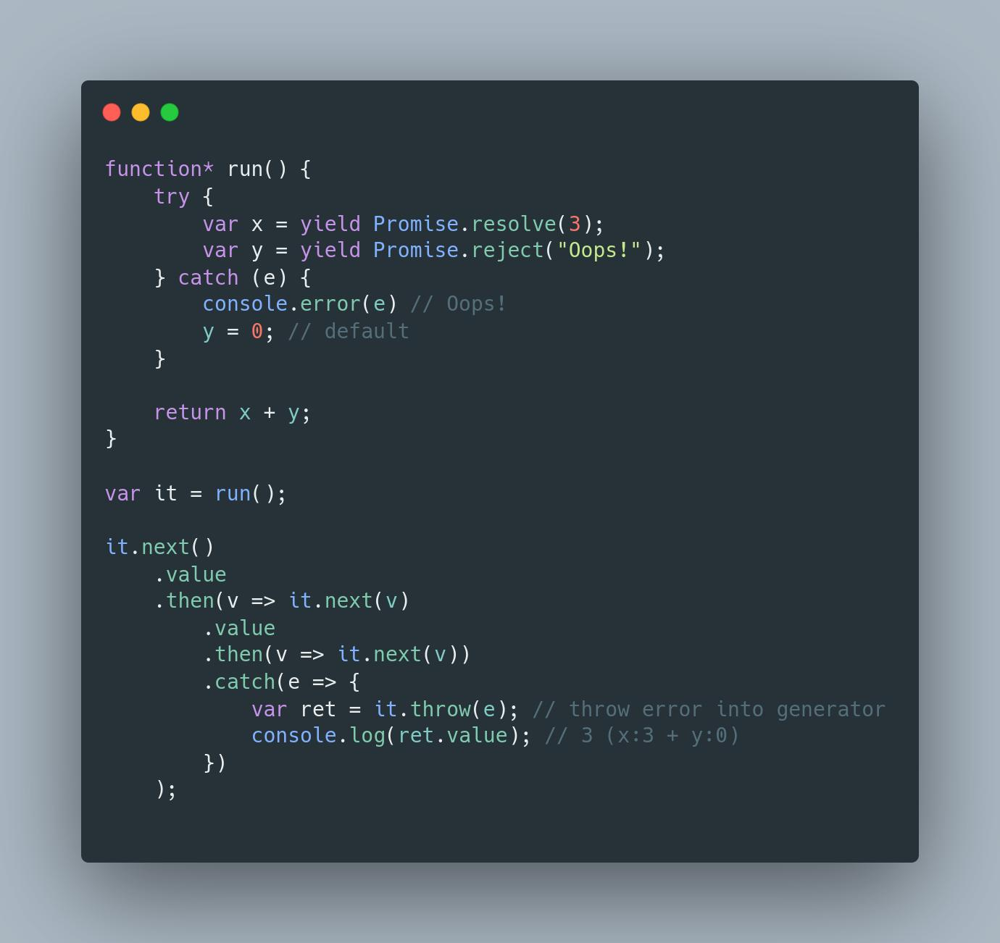
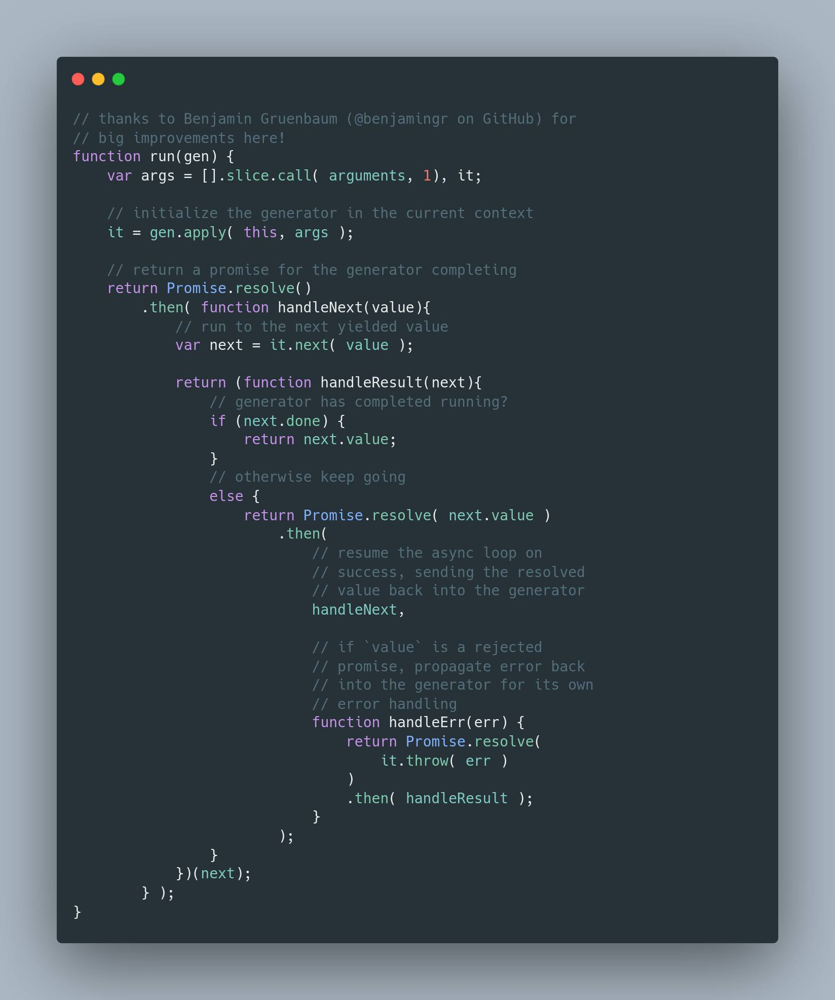
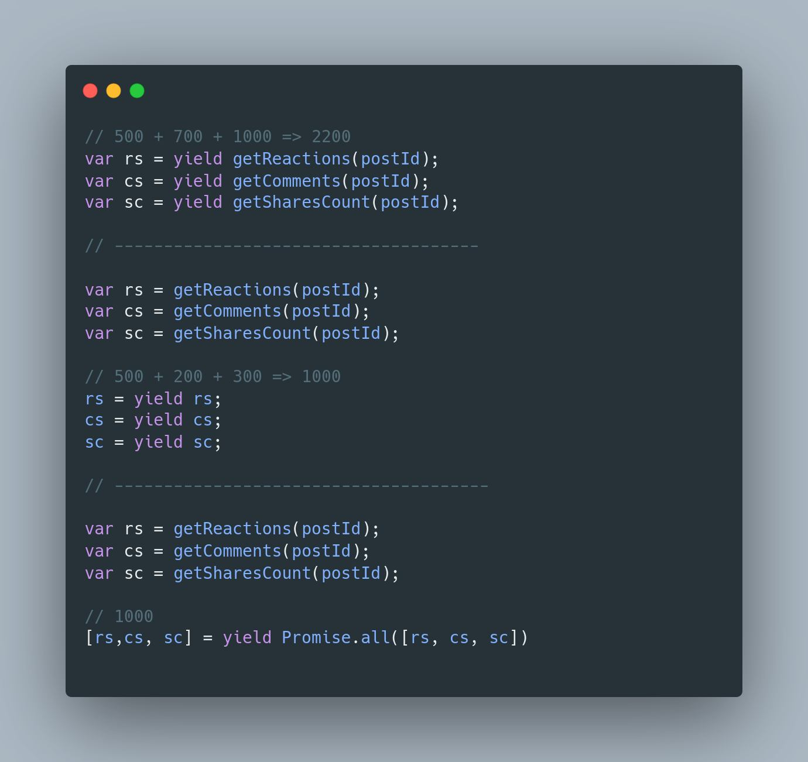

# How async/await works in JS

ES 8 မှာ စပြီးပါလာတဲ့ async/await တွေ နောက်ကွယ်မှာ ဘယ်လို အလုပ်လဲ သူတို့ကို ဘယ်လိုမျိုး construct လုပ်ထားသလဲ။
async/await ကို ကောင်းကောင်းနားလည်ဖို့ ဘာတွေ သိထားရမလဲ စသည်ဖြင့် ပြောမှာပါ။ ECMA 8 မတိုင်ခင် JS Land မှာ async/await
မပါလာသေးခင် ECMA 6 မှာကတည်းက iterators, generators နဲ့ promises တွေပါလာပါပြီ။ promises တွေက ES6 မတိုင်ခင်တည်းက third
party lib တွေနဲ့ သုံးနေကြတာပါ။ အနည်းဆုံး ဒီသုံးခုကိုတော့ သိထားဖို့လိုပါတယ်။ JS ရဲ့ asynchronous မှာ callback တွေကနေ
nesting, inversion of control, state control နဲ့ sequential မဖြစ်တာ စတဲ့ ပြသနာတွေကို ဖြေရှင်းဖို့ Promise တွေကို
ပြောင်းသုံးလာကြတယ်။ asynchronous code တွေက sequential execute လုပ်တာမဟုတ်တဲ့ အတွက် programmer တွေအနေနဲ့ code
ကိုပြန်ဖတ်ရတဲ့အချိန်မျိုး၊ debug လုပ်တဲ့အချိန်မျိုးမှာ တော်တော်လေး ပင်ပန်းပါတယ်။ ဥပမာ login လုပ်မယ် နောက် user ရဲ့ post
တစ်ခုနဲ့ comments တွေနဲ့တွဲ ပြမယ်ဆိုပါစို့။ callback နဲ့ဆိုရင်

```js
goLogin(credentials, user =>
    getPost(user._id, post =>
        getComments(post._id, comments =>
            render(user, post, comments)
        )
    )
)
```

ဒီမှာ error handling မပါသေးဘူး။ ဒီနေရာမှာ အဓိက ပြောချင်တာက sequential မဖြစ်တာပေါ့။ ဒီကောင့်ကို Promise
နဲ့ပြန်ရေးမယ်ဆိုရင် render က curried လုပ်ပြီးသား ဖြစ်မယ်ဆိုရင်တောင်

```js
getLogin(credentials)
    .then(user =>
        getPost(user._id)
            .then(post =>
                getComment(post._id)
                    .then(render(user, post))
            )
    )
```

အနည်းဆုံး ဒီလိုရေးရမယ်။ အောက်ကလို လုပ်လို့ရမဘူး။

```js
getLogin(credentials)
    .then(user => getPost(user._id))
    .then(post => // user?)
```

ပြသနာက ဘာလဲဆိုတော့ user, post, comments သုံးခုလုံးကို final result အနေနဲ့ လိုတဲ့အခြေနေမျိုးဆိုရင် ဒုတိယ ပုံစံနဲ့ အဆင်မပြေတော့ဘူး။ ဒါက နားလည်အောင် ဥပမာ တစ်ခုအနေနဲ့ပြတာပါ။ ပထမ asynchronous operation ကနေပြန်ရလာတဲ့ result ကို တစ်ကြိမ်ပဲသုံးမယ် နောင်တစ်ချိန်မှာ ပြန်သုံးဖို့မလိုဘူးဆိုရင်တော့ promise ရဲ့ .then().then() chain နဲ့အဆင်ပြေတယ်။ အပေါ်ကလို အခြေနေမှာဆိုရင် promise ရဲ့ sequential chain သည်လည်း အသုံးမဝင်တော့ဘူး။ sequential ဖြစ်မဖြစ် ဆိုတဲ့ အခြေနေအရကြည့်ရင် callback နဲ့ရေးရတာနဲ့ သိပ်ပြီး မထူးခြားတော့ဘူးပေါ့။ Generators JS မှာ  generators တွေမတိုင်ခင်က function တိုင်းမှာ run-to-completion semantic ရှိတယ်။ function တစ်ခုကို run လိုက်တာနဲ့ function body ဆုံးတဲ့အထိ return statement ပါရင် အဲ့ဒီ statement အထိ run တယ်။ run နေရင်း ကြားထဲမှာ ရပ်သွားတာမျိုး၊ ရပ်လို့ရတာမျိုး မရှိဘူး။ function တစ်ခုကနေ တစ်ခြား function တစ်ခုကို လှမ်းခေါ်တာမျိုးကိုတော့ ခဏဖယ်ထားပေါ့။
"မြင်သာအောင် example code တွေမှာ generator function ကို ခေါ်မယ်ဆိုရင် fn() အစား *fn() လို့ရေးပါမယ်"

```js
function* run() {
    yield;
    yield 3;
    var a = yield 4;
    return a + 1;
}

var it = run();
it.next().value // undefined
it.next().value // 3
it.next().value // 4
it.next(10).value // 11
```

generators တွေမှာကျတော့ အလွယ်ပြောရရင် run နေရင်းနဲ့ pause လုပ်လို့ရတယ်။ generator function ကို ပထမဆုံးအကြိမ်
ခေါ်မယ်ဆိုရင် iterator တစ်ခုပြန်ပေးတယ်ဆိုတာ သိကြမှာပါ။ ပထမဆုံး အကြိမ် var it = *run() ဆိုပြီး ခေါ်လိုက်ရုံနဲ့ generator function က ထပြီး execute မလုပ်ပါဘူး။ iterator ရဲ့ next ကို ပထမဆုံး အကြိမ်ခေါ်မယ်ဆိုရင် generator function ကို စ run ပါပြီ။ yield ဆိုတဲ့ နေရာမှာ generator function က လက်ရှိ execute လုပ်နေတာကို ရပ်လိုက်ပြီး သူ့ရဲ့ caller, ဒီနေရာမှာဆို global execution context ကို control ပြန်ပေးလိုက်တယ်။
`yield value` ဆိုရင် generator ကနေ pause လုပ်ပြီး value တစ်ခုကိုပါ ပြန်ပေးလိုက်တဲ့ သဘောပါ။ generator ကနေ yield
လုပ်လိုက်တဲ့ value ကို it.next() ရဲ့ return value အနေနဲ့ access လုပ်လို့ရတယ်။ ဥပမာ var x = it.next() လို့ ခေါ်လို့ yield 3 မှာရပ်သွားမယ်ဆိုရင် x.value သည် 3 ပါ။ ဒါတော့ သိမယ်ထင်ပါတယ်။ pause လုပ်ပြီးလို့ yield နေရာမှာ ရပ်သွားတာကနေ နောက်တစ်ကြိမ် ပြန် resume လုပ်မယ်ဆိုရင် ရပ်သွားတဲ့ generator ထဲက yield နေရာကို ပြင်ပကနေ value တစ်ခုခုလှမ်းပေးလို့ရပါတယ်။
it.next ကို ခေါ်တဲ့အချိန်မှာ argument အနေနဲ့ ပေးလိုက်ရင်ရပါပြီ။ အပေါ်က example မှာဆိုရင် it.next(10) လို့ပေးလိုက်တဲ့ အချိန်မှာ `yield 4` နေရာမှာ pause ဖြစ်နေတာဖြစ်တဲ့အတွက် အပြင်က ပေးလိုက်တဲ့ 10 သည် `yield 4` နေရာမှာ replace ဖြစ်သွားတယ်လို့ အလွယ်မြင်ကြည့်လို့ရတယ်။ iterator ရဲ့ ပထမဆုံး next မှာ arg အနေနဲ့ တစ်ခုခုပေးရင်တဲ့ အဲ့ဒီ value ကို generator က ignore လုပ်ပါတယ်။ ဘာလို့လဲဆိုရင် အပေါ်မှာပြောခဲ့တဲ့ အတိုင်း it.next ကို ပထမဆုံး အကြိမ်ခေါ်မှ generator function ကို စပြီး execute လုပ်တာမလို့ပါ။ ဒီတော့ အကျဉ်းချုံးကြည့်ရင် generator တွေကနေ outside ကို value တွေ yield လုပ်လို့ ပြန်ပေးလို့ရသလို outside world ကနေ generator function ထဲကို value တွေပေးလို့ရနေတာပါ။ yield နဲ့ iterator ရဲ့ next သည် two-way message passing ပုံစံနဲ့ အလုပ်လုပ်နေတာပါ။ generator နဲ့ iterators တွေအကြောင်းကို ဒီလောက်နဲ့ပဲထားလိုက်ပြီး အသေးစိတ်ကို ထပ်မရှင်းပြတော့ပါဘူး။

generators တွေအနေနဲ့ iteration ကို asynchronously ဘယ်လိုအလုပ်နိုင်လဲပေါ့။ yield လုပ်တဲ့နေရာမှာ value သည် example ပြထားသလို number မှမဟုတ်ဘူး primitive value မှရယ်မဟုတ်ဘူး၊ value တစ်ခု object, array, functions… စသည်ဖြင့် yield လုပ်လို့ရတယ်။ ဒီတော့ promise တစ်ခုကို yield လုပ်မယ်။ အပြင်ကနေ ရလာတဲ့ promise ရဲ့ fulfilled or rejected state ပေါ်မူတည်ပြီး generator ကို resume လုပ်မယ်ဆိုရင် ဘာဖြစ်မလဲပေါ့။ ပုံမှာ resolve နဲ့ reject ဖြစ်မဲ့ promise နှစ်ခုကို yield လုပ်ပြီးတော့ example ထည့်ပေးထားတယ်။ ပထမဆုံး it.next ကို ခေါ်တဲ့အခါမှာ generator ကနေ resolve ဖြစ်မဲ့ promise ကို
yield လုပ်လိုက်တယ်။ အဲ့ဒီပြန်ရလာတဲ့ promise resolve ဖြစ်သွားရင် resolve ဖြစ်သွားတဲ့ value နဲ့ generator fn ကို ပြန်ပြီး resume လုပ်တယ်။ ရှေ့မှာမြင်ခဲ့တဲ့ it.next ကနေ arg အဖြစ်လှမ်းပေးလိုက်တာပေါ့။ generator ထဲက x နေရာမှာ 3 ဝင်သွားမယ်ပေါ့။ တကယ်လို့ rejected promise ဖြစ်မယ်ဒါမှမဟုတ် callback နဲ့တွဲသုံးမယ်ဆိုလည်း error state ဆိုရင် generator ထဲကို value ပြန်ပြီး pass လုပ်မဲ့အစား error throw လုပ်မယ်ပေါ့။ ဒီအတွက် iterator interface ရဲ့ throw ကိုသုံးလို့ရတယ်။ `it.throw(e)` ဒီလို ပြန်ပြီး throw လုပ်တာသည် generator function body ထဲမှာ တစ်နေရာရာမှာ error throw လုပ်တာနဲ့တူတူပဲ။ ဆိုလိုတာက .then .catch အစား try catch နဲ့ဖမ်းလို့ရသွားတယ်။ promise chain မှာလို တစ်ခုချင်းစီအတွက် specific error handler တွေသုံးမဲ့အစား ဝင်လာမဲ့ error instance ပေါ်မူတည်ပြီး တစ်နေတည်းမှာ handle လုပ်လို့ရသွားတယ်။ code က ပိုပြီး clean ဖြစ်မယ်။ ပုံမှာပြထားတဲ့ example သည် promise ရဲ့ resolution ပေါ်မူတည်ပြီး manually pause/resume လုပ်တာ။ promise နှစ်ခုတည်းမလို့ လွယ်ကောင်းလွယ်မယ်။ တစ်ခု handy ဖြစ်တာက yield လုပ်တဲ့ နေရာများမယ် promise တွေများလာမယ်ဆိုရင် promise တွေရဲ့ ဖြစ်နိုင်ချေရှိသမျှ path မှာ pause/resume လုပ်ရမယ်၊ value or error စသည်ဖြင့် ဘာ pass လုပ်ရမလဲ စသည်ဖြင့် control လုပ်တဲ့နေရာမှာ ထောင့်စေ့အောင် လိုက်ရေးဖို့လိုတယ်။ လက်တွေ့မှာတော့ ကိုယ်တိုင် implement လုပ်တာထက် third party lib တွေ ဥပမာ q တို့ Fluture တို့ asynquence တို့လို့ lib တွေကနေ controller function တွေပေးထားတာရှိတယ်။ အဲ့တာတွေ သုံးလို့ရတယ်။ ဒါပေမဲ့ ဘယ်လိုအလုပ်လုပ်လဲဆိုတာ သိထားဖို့တော့လိုတယ်။ example အနေနဲ့ ပုံမှာ ydkjs ကနေယူပြီး တစ်ခုထည့်ပေးထားတယ်။ ပိုကောင်းသွားတဲ့ အချက် ကဘာလဲဆိုရင် generator function ရဲ့ body ကိုပဲရေးစရာလိုတယ်။ ဆိုလိုချင်တာက promise ကို yield လုပ်တာကိုပဲ focus ထားလို့ရတယ်။ ဟိုးအပေါ်မှာ ပြခဲ့တဲ့ example ကိုပဲ generator နဲ့ပြန်ရေးကြည့်ရင်

```js
function* fn(credentials) {
    var user = yield goLogin(credentials);
    var post = yield getPost(user._id);
    var comments = yield getComments(post._id);

    // or render, we have all three now
    return [user, post, comments];
} 
```

ဒီတော့ code သည် ဘာလုပ်ချင်တာလဲဆိုတာ programmer အနေနဲ့ ဖတ်လိုက်ရင် ပိုရှင်းတယ်။ readability ပိုကောင်းတယ်ပေါ့။ async/await
ဆိုတာက generator + promise ဒီလို အလုပ်လုပ်တဲ့ကောင်ကို syntactic sugar အနေနဲ့ language ကထည့်ပေးထားတာ။ async/await ကိုသိဖို့ဆိုရင် generators, iterators, နဲ့ promise သုံးခုလုံးကို ကောင်းကောင်း သဘောပေါက်ဖို့ လိုပါတယ်။ ဒီမှာတော့ အကုန်မရှင်းပြတော့ပါဘူး။ တစ်ခြား ဥပမာ infinite iterators တွေ ဘယ်တော့မှမရပ်ပဲ value အမြဲပြန်ပေးနေတဲ့ generators တွေကို iterator ဖက်ကနေ ဘယ်လို control လုပ်ပြီး end ခိုင်းလိုက်လို့ရလဲ၊ နောက် asynchronous task  တွေလုပ်တဲ့အခါမှာ တစ်ချို့က promise တွေ့တာနဲ့ တန်းပြီး await ( ဒီမှာဆို yield ပေါ့ ) ထည့်တယ်။ ဒီလိုလုပ်တာသည် မကောင်းဘူး။ generator တွေက pause ဖြစ်သွားတာဖြစ်တဲ့အတွက် ဥပမာ parallel လုပ်လို့ရတဲ့ကောင်တွေဆိုရင် ဘယ်နားမှာ yield ထည့်ရမလဲပေါ့။ ပုံက နောက်ဆုံး example မှာဆိုရင် reactions api သည် 500ms, comments သည် 700 ms, share count သည် 1000 ms ကြာတယ်ဆိုပါတော့ yield/await ကိုဘယ်နေရာမှာထားလဲပေါ်မူတည်ပြီး application ရဲ့ performance ကကွာသွားမှာပါ။ ဒီတော့ ဘယ်လိုဆိုရင် parallel လုပ်မှာလဲ ဘယ်လိုရေးရင် sequential လုပ်မှာလဲဆိုတာကိုတော့ သိအောင်လုပ်ထားဖို့တော့ လိုပါတယ်။ နောက်ဆုံးပြောချင်တာ တစ်ခုက await လို့ရေးတိုင်း အဲ့ဒီ နေရာသည် blocking ဖြစ်နေတာမဟုတ်ပါဘူး။ ဆိုလိုချင်တာက async/await သည် နောက်ကွယ်မှာ generator ဖြစ်တယ်။ async task တစ်ခုခု လုပ်နေတယ်ဆိုရင် အဲ့ဒီ task မပြီးမချင်း block ဖြစ်နေတာမဟုတ်ပါဘူး။ async task resolve or reject ဖြစ်တဲ့အချိန်မှာမှ pause ဖြစ်နေတဲ့ function ကို resume ပြန်လုပ်တာပါ။




